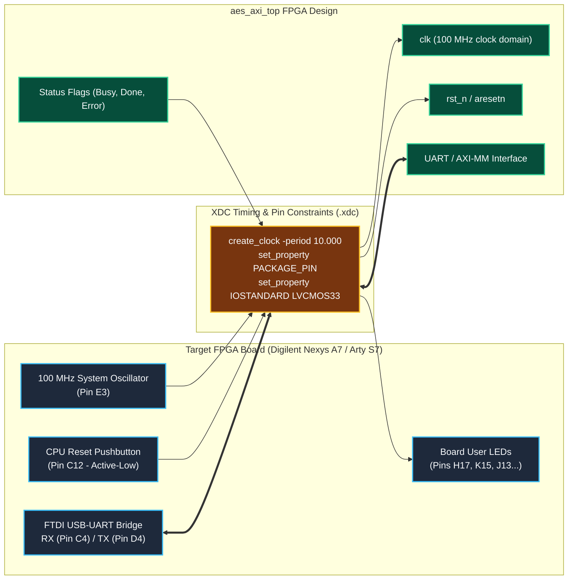

# Constraints Directory

This directory stores target board timing and physical constraints:

- `nexys_a7.xdc`: Digilent Nexys A7 (XC7A100T-1CSG324C / XC7A50T) constraint file.
- `arty_s7.xdc`: Digilent Arty S7 constraint file (secondary/backup platform).

> **Important**: Pin mappings must be verified against the authoritative board reference manual before bitstream generation.

---

## Target Board Constraint Topology

