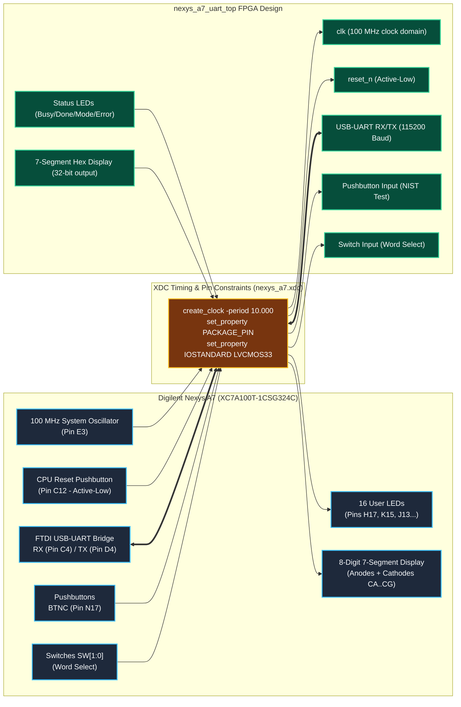

# Constraints Directory

This directory stores target board timing and physical constraints:

- `nexys_a7.xdc`: Digilent Nexys A7 (XC7A100T-1CSG324C) master constraint file.

> **Important**: Pin mappings must be verified against the authoritative board reference manual before bitstream generation.

---

## Target Board Constraint Topology

---

## Mapped Peripherals

| Peripheral | Nexys A7 Pin(s) | FPGA Port | IOSTANDARD |
|:-----------|:----------------|:----------|:-----------|
| 100 MHz Clock | E3 | `clk` | LVCMOS33 |
| CPU Reset (Active-Low) | C12 | `reset_n` | LVCMOS33 |
| UART RX (from PC) | C4 | `uart_rx` | LVCMOS33 |
| UART TX (to PC) | D4 | `uart_tx` | LVCMOS33 |
| 16 LEDs | H17, K15, J13, ... | `led[15:0]` | LVCMOS33 |
| 7-Seg Anodes (8 digits) | J17, J18, T9, ... | `an[7:0]` | LVCMOS33 |
| 7-Seg Cathodes | T10, R10, K16, ... | `seg[6:0]`, `dp` | LVCMOS33 |
| Center Button | N17 | `btn_c` | LVCMOS33 |
| Switches | J15, L16 | `sw[1:0]` | LVCMOS33 |
