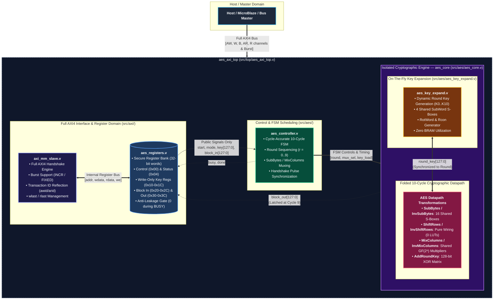

# PS06 Architecture Specification
## Hardware AES-128 Symmetric Block Cipher Core with AXI-MM Interface

---

## 1. Executive Summary & Mandatory Constraints

The **PS06 AES-128 AXI-MM Hardware Accelerator** is designed to satisfy the strict VELTRAXX '26 August 28 Final Challenge Specifications:

1. **NIST Compliance**: Full standard AES-128 encryption and decryption with SubBytes, ShiftRows, MixColumns, AddRoundKey, and corresponding inverse transformations.
2. **Full AXI4-MM System Interface**: Full AXI4 Memory-Mapped slave with burst transfer support (`INCR`/`FIXED`), transaction ID reflection, and `wlast`/`rlast` management for seamless high-performance SoC integration.
3. **Hardened Security**: Complete isolation of internal intermediate states and dynamic round keys from bus read access.
4. **On-the-Fly Round-Key Generation**: Round keys dynamically produced during execution. Pre-computed BRAM round-key storage is **strictly prohibited**.
5. **LUT Budget**: Final synthesized design must be **strictly under 1,500 4-input LUTs** on AMD 7-Series FPGA.
6. **Throughput Target**: At least **1 complete 128-bit block every 10 clock cycles** ($II = 10$).

---

## 2. System Architecture & Modular Hierarchy

### Module Breakdown (`src/`):
- `src/top/aes_axi_top.v`: System top-level integrating AXI slave, register bank, and AES engine.
- `src/axi/axi_mm_slave.v`: Full AXI4 memory-mapped handshake engine managing AW, W, B, AR, R channels with burst support.
- `src/axi/aes_registers.v`: Secure register bank isolating internal cryptographic state.
- `src/aes/aes_controller.v`: Cycle-accurate FSM orchestrating 10-cycle execution schedule.
- `src/aes/aes_core.v`: Central core housing the folded datapath and dynamic key expansion.
- `src/aes/aes_key_expand.v`: Generates $K_1 \dots K_{10}$ on the fly in sync with round operations.
- `src/aes/aes_sbox.v` & `aes_inv_sbox.v`: Optimized Galois-field / LUT-efficient S-Box implementations.
- `src/aes/aes_subbytes.v` & `aes_inv_subbytes.v`: State byte substitution arrays.
- `src/aes/aes_shiftrows.v` & `aes_inv_shiftrows.v`: Combinational wiring permutation.
- `src/aes/aes_mixcolumns.v` & `aes_inv_mixcolumns.v`: Efficient $GF(2^8)$ matrix multiplication.
- `src/aes/aes_addroundkey.v`: 128-bit XOR matrix.

---

## 3. Dynamic Pipeline Folding & Resource-Sharing Strategy (< 1,500 LUTs)

To satisfy the strict **< 1,500 LUT limit** while delivering **$\ge 1$ block per 10 cycles**:

### Design Choices:
1. **Iterative Round Engine**:
   - Instead of unrolling 10 rounds (which requires 160 S-boxes and >10,000 LUTs), a single round engine executes iteratively across 10 clock cycles.
2. **S-Box Resource Sharing**:
   - Forward encryption and inverse decryption share sub-expressions or composite field / optimized combinational logic.
   - S-box logic is shared across the datapath and key expansion where schedule allows, or key expansion utilizes 4 S-boxes while the main round uses 16 parallel S-boxes (compact combinational S-box requires ~25-30 LUTs each, totaling ~500-600 LUTs for 20 S-boxes, comfortably within 1,500 LUTs).
3. **Pure Logic Transformations**:
   - `ShiftRows`: Pure combinational rewiring ($0$ LUTs).
   - `AddRoundKey`: Pure 128-bit XOR ($128$ LUTs).
   - `MixColumns`: Shared $GF(2^8)$ constant multiplier trees ($2 \cdot x$, $3 \cdot x$, $9 \cdot x$, $11 \cdot x$, $13 \cdot x$, $14 \cdot x$) with shared XOR chains.
4. **Zero BRAM Overhead**:
   - On-the-fly round key generation synthesizes purely into distributed registers/LUTs, eliminating BRAM entirely.

---

## 4. 10-Cycle Datapath & Timing Schedule

To achieve an Initiation Interval of 10 cycles ($II = 10$):

| Cycle | Operation | Round Key Applied | State Action | Key Expand Action |
|:-----:|:----------|:-----------------:|:-------------|:------------------|
| **0** | Init / Round 1 | $K_0$, $K_1$ | AddRoundKey($K_0$) $\rightarrow$ SubBytes $\rightarrow$ ShiftRows $\rightarrow$ MixColumns $\rightarrow$ AddRoundKey($K_1$) | $K_0 \rightarrow K_1$ |
| **1** | Round 2 | $K_2$ | SubBytes $\rightarrow$ ShiftRows $\rightarrow$ MixColumns $\rightarrow$ AddRoundKey($K_2$) | $K_1 \rightarrow K_2$ |
| **2** | Round 3 | $K_3$ | SubBytes $\rightarrow$ ShiftRows $\rightarrow$ MixColumns $\rightarrow$ AddRoundKey($K_3$) | $K_2 \rightarrow K_3$ |
| **3** | Round 4 | $K_4$ | SubBytes $\rightarrow$ ShiftRows $\rightarrow$ MixColumns $\rightarrow$ AddRoundKey($K_4$) | $K_3 \rightarrow K_4$ |
| **4** | Round 5 | $K_5$ | SubBytes $\rightarrow$ ShiftRows $\rightarrow$ MixColumns $\rightarrow$ AddRoundKey($K_5$) | $K_4 \rightarrow K_5$ |
| **5** | Round 6 | $K_6$ | SubBytes $\rightarrow$ ShiftRows $\rightarrow$ MixColumns $\rightarrow$ AddRoundKey($K_6$) | $K_5 \rightarrow K_6$ |
| **6** | Round 7 | $K_7$ | SubBytes $\rightarrow$ ShiftRows $\rightarrow$ MixColumns $\rightarrow$ AddRoundKey($K_7$) | $K_6 \rightarrow K_7$ |
| **7** | Round 8 | $K_8$ | SubBytes $\rightarrow$ ShiftRows $\rightarrow$ MixColumns $\rightarrow$ AddRoundKey($K_8$) | $K_7 \rightarrow K_8$ |
| **8** | Round 9 | $K_9$ | SubBytes $\rightarrow$ ShiftRows $\rightarrow$ MixColumns $\rightarrow$ AddRoundKey($K_9$) | $K_8 \rightarrow K_9$ |
| **9** | Round 10 (Final) | $K_{10}$ | SubBytes $\rightarrow$ ShiftRows $\rightarrow$ **No MixColumns** $\rightarrow$ AddRoundKey($K_{10}$) | $K_9 \rightarrow K_{10}$, Latch Result, Assert `DONE` |

- **Initiation Interval ($II$)**: 10 clock cycles.
- **Latency**: 10 clock cycles from `START` to `DONE`.
- **Sustained Throughput**: At 100 MHz clock frequency:
  $$\text{Throughput} = \frac{128 \text{ bits}}{10 \times 10 \text{ ns}} = 1.28 \text{ Gbps}$$

---

## 5. Standard 128-bit State Bit-Slice Mapping

FIPS-197 column-major matrix mapped strictly across all modules:

| Byte Index | Matrix Position | Verilog Slice `state[...]` | Column / Word |
|:----------:|:---------------:|:--------------------------:|:-------------:|
| $s_0$      | Row 0, Col 0    | `[127:120]`                | Word 0 (Col 0) `[127:96]` |
| $s_1$      | Row 1, Col 0    | `[119:112]`                | Word 0 (Col 0) `[127:96]` |
| $s_2$      | Row 2, Col 0    | `[111:104]`                | Word 0 (Col 0) `[127:96]` |
| $s_3$      | Row 3, Col 0    | `[103:96]`                 | Word 0 (Col 0) `[127:96]` |
| $s_4 \dots s_7$   | Col 1    | `[95:64]`                  | Word 1 (Col 1) `[95:64]`  |
| $s_8 \dots s_{11}$  | Col 2  | `[63:32]`                  | Word 2 (Col 2) `[63:32]`  |
| $s_{12} \dots s_{15}$ | Col 3| `[31:0]`                   | Word 3 (Col 3) `[31:0]`   |
