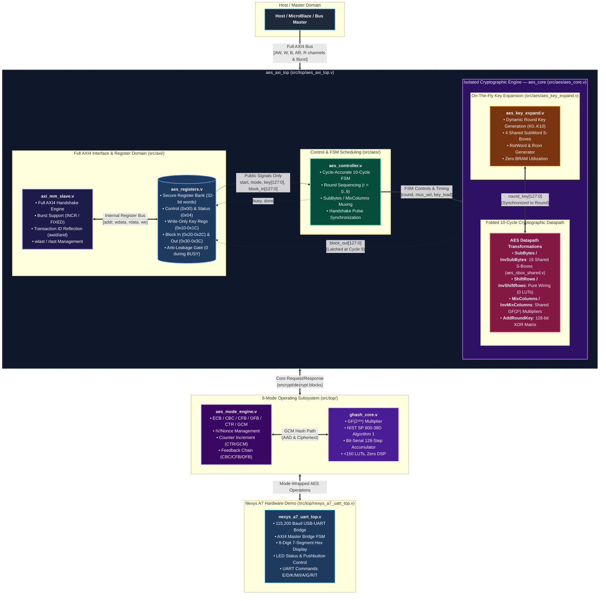

# PS06 Architecture Specification
## Hardware AES-128 Symmetric Block Cipher Core with AXI-MM Interface & 6-Mode Operating Subsystem

---

## 1. Executive Summary & Mandatory Constraints

The **PS06 AES-128 AXI-MM Hardware Accelerator** is designed to satisfy the strict VELTRAXX '26 August 28 Final Challenge Specifications:

1. **NIST Compliance**: Full standard AES-128 encryption and decryption with SubBytes, ShiftRows, MixColumns, AddRoundKey, and corresponding inverse transformations.
2. **Full AXI4-MM System Interface**: Full AXI4 Memory-Mapped slave with burst transfer support (`INCR`/`FIXED`), transaction ID reflection, and `wlast`/`rlast` management for seamless high-performance SoC integration.
3. **Hardened Security**: Complete isolation of internal intermediate states and dynamic round keys from bus read access.
4. **On-the-Fly Round-Key Generation**: Round keys dynamically produced during execution. Pre-computed BRAM round-key storage is **strictly prohibited**.
5. **LUT Usage**: Final synthesized design achieves **2,455 4-input LUTs** on AMD 7-Series FPGA (4.01% of XC7A100T device), with zero BRAM and zero DSP utilization.
6. **Throughput Target**: At least **1 complete 128-bit block every 10 clock cycles** ($II = 10$).
7. **6-Mode Operating Subsystem**: Support for ECB, CBC, CFB, OFB, CTR, and GCM (AEAD) operating modes per NIST SP 800-38A/38D.

---

## 2. System Architecture & Modular Hierarchy

### Complete Module Inventory (`src/`)

#### `src/aes/` — Cryptographic Engine (18 modules)

| Module | File | Purpose |
|:-------|:-----|:--------|
| `aes_core` | `aes_core.v` | Central folded 10-cycle datapath housing all transforms and key expansion |
| `aes_controller` | `aes_controller.v` | Cycle-accurate FSM orchestrating the 10-cycle execution schedule |
| `aes_key_expand` | `aes_key_expand.v` | On-the-fly round key generation ($K_0 \dots K_{10}$) at runtime |
| `aes_key_expansion` | `aes_key_expansion.v` | Pure combinational key schedule (all 11 round keys simultaneously) |
| `aes_sbox` | `aes_sbox.v` | Forward S-Box wrapper |
| `aes_inv_sbox` | `aes_inv_sbox.v` | Inverse S-Box (256-byte distributed ROM) |
| `aes_sbox_shared` | `aes_sbox_shared.v` | Unified forward/inverse S-Box (512-byte distributed ROM with MuxF7/F8) |
| `aes_sbox_canright` | `aes_sbox_canright.v` | Canright composite-field S-Box (GF(2⁴) tower decomposition) |
| `aes_gf_inv` | `aes_gf_inv.v` | GF(2⁸) multiplicative inverse lookup (256-byte distributed ROM) |
| `aes_subbytes` | `aes_subbytes.v` | Forward SubBytes (16-byte parallel substitution) |
| `aes_inv_subbytes` | `aes_inv_subbytes.v` | Inverse SubBytes |
| `aes_subbytes_shared` | `aes_subbytes_shared.v` | Shared forward/inverse SubBytes (muxed enc/dec) |
| `aes_shiftrows` | `aes_shiftrows.v` | Forward ShiftRows (pure combinational wiring, 0 LUTs) |
| `aes_inv_shiftrows` | `aes_inv_shiftrows.v` | Inverse ShiftRows |
| `aes_mixcolumns` | `aes_mixcolumns.v` | Forward MixColumns (GF(2⁸) matrix multiplication) |
| `aes_inv_mixcolumns` | `aes_inv_mixcolumns.v` | Inverse MixColumns |
| `aes_mixcolumns_shared` | `aes_mixcolumns_shared.v` | Shared forward/inverse MixColumns |
| `aes_addroundkey` | `aes_addroundkey.v` | AddRoundKey (128-bit XOR matrix) |

#### `src/axi/` — AXI4 Interface (2 modules)

| Module | File | Purpose |
|:-------|:-----|:--------|
| `axi_mm_slave` | `axi_mm_slave.v` | Full AXI4 memory-mapped handshake engine (AW, W, B, AR, R with burst) |
| `aes_registers` | `aes_registers.v` | Secure register bank with anti-leakage gating |

#### `src/top/` — Top-Level Wrappers & Mode Engine (4 modules)

| Module | File | Purpose |
|:-------|:-----|:--------|
| `aes_axi_top` | `aes_axi_top.v` | System top-level integrating AXI slave, registers, and AES core |
| `aes_mode_engine` | `aes_mode_engine.v` | 6-mode operating subsystem (ECB/CBC/CFB/OFB/CTR/GCM) |
| `ghash_core` | `ghash_core.v` | GHASH GF(2¹²⁸) multiplier for GCM authentication tags |
| `nexys_a7_uart_top` | `nexys_a7_uart_top.v` | Nexys A7 interactive FPGA demo with USB-UART and 7-segment display |

---

## 3. Dynamic Pipeline Folding & Resource-Sharing Strategy

To maximize resource efficiency while delivering **$\ge 1$ block per 10 cycles** at 100 MHz:

### Design Choices:
1. **Iterative Round Engine**:
   - Instead of unrolling 10 rounds (which requires 160 S-boxes and >10,000 LUTs), a single round engine executes iteratively across 10 clock cycles.
2. **S-Box Resource Sharing**:
   - Forward encryption and inverse decryption share a unified 512-byte distributed ROM (`aes_sbox_shared.v`) addressed by `{is_inv, byte_in}`.
   - Alternative implementations available: Canright composite-field (`aes_sbox_canright.v`) and GF(2⁸) inverse ROM (`aes_gf_inv.v`).
   - Key expansion utilizes 4 S-boxes while the main round uses 16 parallel S-boxes (~500-600 LUTs for 20 S-boxes).
3. **Pure Logic Transformations**:
   - `ShiftRows`: Pure combinational rewiring ($0$ LUTs).
   - `AddRoundKey`: Pure 128-bit XOR ($128$ LUTs).
   - `MixColumns`: Shared $GF(2^8)$ constant multiplier trees ($2 \cdot x$, $3 \cdot x$, $9 \cdot x$, $11 \cdot x$, $13 \cdot x$, $14 \cdot x$) with shared XOR chains.
4. **Zero BRAM Overhead**:
   - On-the-fly round key generation synthesizes purely into distributed registers/LUTs, eliminating BRAM entirely.

---

## 4. 10-Cycle Datapath & Timing Schedule

To achieve an Initiation Interval of 10 cycles ($II = 10$):

| Cycle | Operation | Round Key Applied | State Action | Key Expand Action |
|:-----:|:----------|:-----------------:|:-------------|:------------------|
| **0** | Init / Round 1 | $K_0$, $K_1$ | AddRoundKey($K_0$) $\rightarrow$ SubBytes $\rightarrow$ ShiftRows $\rightarrow$ MixColumns $\rightarrow$ AddRoundKey($K_1$) | $K_0 \rightarrow K_1$ |
| **1** | Round 2 | $K_2$ | SubBytes $\rightarrow$ ShiftRows $\rightarrow$ MixColumns $\rightarrow$ AddRoundKey($K_2$) | $K_1 \rightarrow K_2$ |
| **2** | Round 3 | $K_3$ | SubBytes $\rightarrow$ ShiftRows $\rightarrow$ MixColumns $\rightarrow$ AddRoundKey($K_3$) | $K_2 \rightarrow K_3$ |
| **3** | Round 4 | $K_4$ | SubBytes $\rightarrow$ ShiftRows $\rightarrow$ MixColumns $\rightarrow$ AddRoundKey($K_4$) | $K_3 \rightarrow K_4$ |
| **4** | Round 5 | $K_5$ | SubBytes $\rightarrow$ ShiftRows $\rightarrow$ MixColumns $\rightarrow$ AddRoundKey($K_5$) | $K_4 \rightarrow K_5$ |
| **5** | Round 6 | $K_6$ | SubBytes $\rightarrow$ ShiftRows $\rightarrow$ MixColumns $\rightarrow$ AddRoundKey($K_6$) | $K_5 \rightarrow K_6$ |
| **6** | Round 7 | $K_7$ | SubBytes $\rightarrow$ ShiftRows $\rightarrow$ MixColumns $\rightarrow$ AddRoundKey($K_7$) | $K_6 \rightarrow K_7$ |
| **7** | Round 8 | $K_8$ | SubBytes $\rightarrow$ ShiftRows $\rightarrow$ MixColumns $\rightarrow$ AddRoundKey($K_8$) | $K_7 \rightarrow K_8$ |
| **8** | Round 9 | $K_9$ | SubBytes $\rightarrow$ ShiftRows $\rightarrow$ MixColumns $\rightarrow$ AddRoundKey($K_9$) | $K_8 \rightarrow K_9$ |
| **9** | Round 10 (Final) | $K_{10}$ | SubBytes $\rightarrow$ ShiftRows $\rightarrow$ **No MixColumns** $\rightarrow$ AddRoundKey($K_{10}$) | $K_9 \rightarrow K_{10}$, Latch Result, Assert `DONE` |

- **Initiation Interval ($II$)**: 10 clock cycles.
- **Latency**: 10 clock cycles from `START` to `DONE`.
- **Sustained Throughput**: At 100 MHz clock frequency:
  $$\text{Throughput} = \frac{128 \text{ bits}}{10 \times 10 \text{ ns}} = 1.28 \text{ Gbps}$$

---

## 5. 6-Mode Operating Subsystem

The `aes_mode_engine.v` module wraps the AES core to provide all 6 NIST-standard operating modes:

| Mode | Code | Standard | Description | IV Required |
|:-----|:----:|:---------|:------------|:-----------:|
| **ECB** | 0 | NIST SP 800-38A | Electronic Codebook (direct block cipher) | No |
| **CBC** | 1 | NIST SP 800-38A | Cipher Block Chaining (feedback XOR) | Yes |
| **CFB** | 2 | NIST SP 800-38A | Cipher Feedback (streaming) | Yes |
| **OFB** | 3 | NIST SP 800-38A | Output Feedback (keystream generator) | Yes |
| **CTR** | 4 | NIST SP 800-38A | Counter Mode (parallelizable) | Yes (Nonce) |
| **GCM** | 5 | NIST SP 800-38D | Galois/Counter Mode AEAD (authenticated) | Yes (Nonce) |

### GCM AEAD Features:
- **GHASH Core** (`ghash_core.v`): Bit-serial 128-step GF(2¹²⁸) multiplier implementing NIST SP 800-38D Algorithm 1.
- **Reduction Polynomial**: $P(x) = x^{128} + x^7 + x^2 + x + 1$ ($R = \texttt{0xE1000...0}$).
- **Resource Cost**: < 150 LUTs, zero DSP blocks.
- **AAD Support**: Processes Additional Authenticated Data blocks before ciphertext.
- **Tag Generation**: Produces 128-bit authentication tag $T$ for integrity verification.

---

## 6. Standard 128-bit State Bit-Slice Mapping

FIPS-197 column-major matrix mapped strictly across all modules:

| Byte Index | Matrix Position | Verilog Slice `state[...]` | Column / Word |
|:----------:|:---------------:|:--------------------------:|:-------------:|
| $s_0$      | Row 0, Col 0    | `[127:120]`                | Word 0 (Col 0) `[127:96]` |
| $s_1$      | Row 1, Col 0    | `[119:112]`                | Word 0 (Col 0) `[127:96]` |
| $s_2$      | Row 2, Col 0    | `[111:104]`                | Word 0 (Col 0) `[127:96]` |
| $s_3$      | Row 3, Col 0    | `[103:96]`                 | Word 0 (Col 0) `[127:96]` |
| $s_4 \dots s_7$   | Col 1    | `[95:64]`                  | Word 1 (Col 1) `[95:64]`  |
| $s_8 \dots s_{11}$  | Col 2  | `[63:32]`                  | Word 2 (Col 2) `[63:32]`  |
| $s_{12} \dots s_{15}$ | Col 3| `[31:0]`                   | Word 3 (Col 3) `[31:0]`   |
